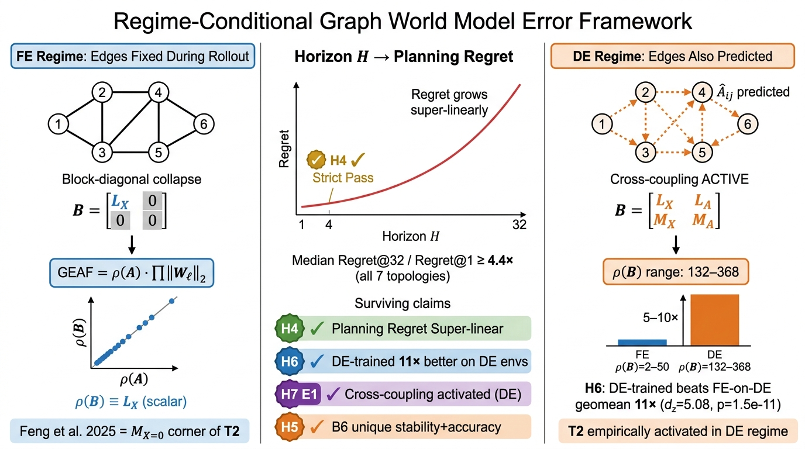
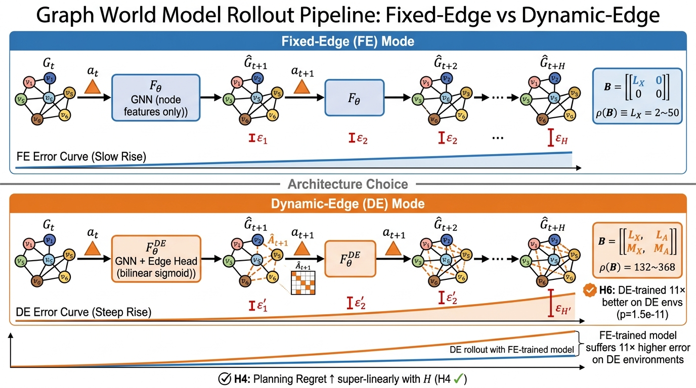

<div align="center">

# Understanding Rollout Error in Graph World Models

**Xinyuan Song, Zekun Cai**

[](https://arxiv.org/abs/2606.27780)
[](https://arxiv.org/pdf/2606.27780)
[](https://github.com/Hik289/graph_world_model_accumulative_error)
[](LICENSE)

**Official implementation for "Understanding Rollout Error in Graph World Models."**

</div>

---

## Overview

World models are often used for planning by rolling learned dynamics forward.
Many planning environments, however, are graphs of agents, tools, skills,
routes, and dependencies rather than vectors or images. In these settings, a
local prediction error may stay local, spread through topology, or amplify when
the edges themselves are predicted during rollout.

This repository provides the benchmark suite, models, metrics, and experiment
scripts for studying **long-horizon rollout error in Graph World Models (GWMs)**.
The paper develops graph-valued rollout bounds that separate topology-induced
amplification from model-induced amplification, introduces a joint node-edge
operator for dynamic-edge rollouts, and proposes **Error-Aware GWM**, which
combines spectral regularization, rollout consistency, and critical-node
weighting.



---

## Highlights

| Question | Takeaway |
|----------|----------|
| How does graph topology affect rollout error? | Error growth depends on topology, horizon, and learned dynamics, not just one-step prediction loss. |
| What changes when edges are predicted? | Dynamic-edge rollouts activate node-edge cross-coupling and can amplify error far beyond fixed-edge rollouts. |
| Can a model remain stable over long horizons? | Error-Aware GWM reduces long-horizon divergence while preserving prediction accuracy. |
| Where are GWMs most useful? | GWMs are strongest for dynamic graph rollout and agent planning; specialized graph models remain strong on static or sparse prediction tasks. |

---

## Rollout Pipeline



The code supports both rollout regimes studied in the paper:

| Regime | Description |
|--------|-------------|
| **Fixed-Edge (FE)** | Node states evolve while graph structure is fixed. |
| **Dynamic-Edge (DE)** | Both node states and edges are predicted at each step. |

Dynamic-edge rollouts use a joint node-edge operator to capture cross-coupled
error propagation. The experiments compare FE-trained and DE-trained models,
measure rollout error and planning regret across horizons, and test whether
Error-Aware GWM stabilizes long-horizon prediction.

---

## Repository Contents

| Component | Location | Purpose |
|-----------|----------|---------|
| Graph generators | `src/graph_generators/` | Synthetic topology generation and graph statistics. |
| Simulators | `src/simulators/` | Dynamic graph, agent calling tree, and platform skill graph simulators. |
| Baselines | `src/baselines/` | MLP, GCN, MPNN, GPS, action-node, and Error-Aware GWM variants. |
| Metrics | `src/metrics/` | NodeMSE, EdgeF1, GEAF, rollout error, regret, and correlation utilities. |
| Scripts | `scripts/` | Dataset generation, baseline training, ablations, dynamic-edge runs, and figures. |
| Figures | `figures/` | Main paper diagrams used in this README. |
| Tests | `tests/` | Pytest checks for generators, simulators, metrics, and B6 patches. |

---

## Installation

```bash
git clone git@github.com:Hik289/graph_world_model_accumulative_error.git
cd graph_world_model_accumulative_error

python3 -m venv .venv
source .venv/bin/activate
pip install -r requirements.txt
```

Python 3.11+ is recommended. CUDA is optional for small tests, but GPU training
is recommended for the full benchmark suite.

---

## Quickstart

Generate the synthetic graph datasets:

```bash
python scripts/p2_generate_all.py --out_dir ./data
```

Train fixed-edge baselines:

```bash
python scripts/p2_run_all_baselines.py \
    --data_root ./data \
    --out_dir ./results
```

Train dynamic-edge baselines:

```bash
python scripts/streamA_de_trained.py \
    --data_root ./data \
    --out_dir ./results/de_trained
```

Run error injection and rollout ablations:

```bash
python scripts/p4_batch.py \
    --data_root ./data \
    --p2_dir ./results/p2_baselines \
    --out_dir ./results/p4
```

Run correction, rewiring, and agent workflow experiments:

```bash
python scripts/p5_p6_batch.py \
    --data_root ./data \
    --p2_dir ./results/p2_baselines \
    --out_dir ./results/p5
```

Generate figures:

```bash
python scripts/gen_p2_figures.py --out_dir ./results/figures
```

---

## Experiments

| Phase | Focus | Script |
|-------|-------|--------|
| P2 | Baseline training across graph topologies and seeds | `scripts/p2_run_all_baselines.py` |
| P3 | Rollout error versus topology, horizon, and scaling | `scripts/p4_batch.py` |
| P4 | Node, edge, bridge, and hub error injection | `scripts/p4_batch.py` |
| P5 | Correction, rewiring, and scheduled-sampling variants | `scripts/p5_p6_batch.py` |
| P6 | Agent calling tree and platform skill graph testbeds | `scripts/p5_p6_batch.py` |
| DE | Dynamic-edge training and node-edge coupling analysis | `scripts/streamA_de_trained.py` |

Run the test suite after installation:

```bash
pytest
```

---

## Directory Structure

```text
graph_world_model_accumulative_error/
|-- README.md
|-- LICENSE
|-- requirements.txt
|-- figures/
|   |-- fig_main.png
|   `-- fig_pipeline.png
|-- scripts/
|-- tests/
`-- src/
    |-- baselines/
    |-- graph_generators/
    |-- metrics/
    |-- simulators/
    `-- utils/
```

---

## Citation

If you use this code, please cite the paper:

```bibtex
@misc{song2026understandingrollouterrorgraph,
  title         = {Understanding Rollout Error in Graph World Models},
  author        = {Xinyuan Song and Zekun Cai},
  year          = {2026},
  eprint        = {2606.27780},
  archivePrefix = {arXiv},
  primaryClass  = {cs.AI},
  url           = {https://arxiv.org/abs/2606.27780}
}
```

## License

Released under the [MIT License](LICENSE). Third-party datasets, libraries, and
models used by the experiments are governed by their own licenses and terms.
